# The Blue Red AI Sales Assistant

The Blue Red is an AI-powered B2B quotation assistant for products, policies, and shared quote management.

The system allows a customer to chat from the mobile app, ask about products or policies, and update the same quote draft that the web admin panel can view.

# Screenshots
## Mobile Application
### Home Screen
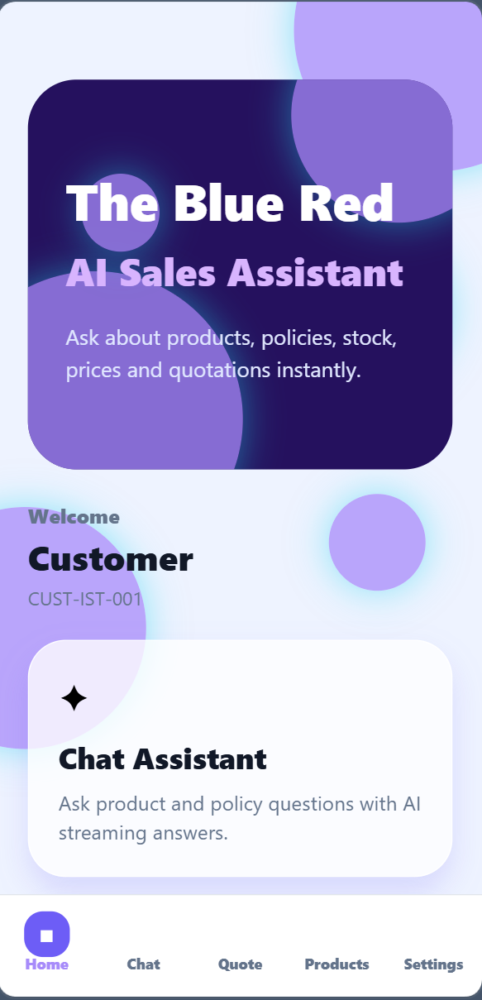


### Chat Assistant
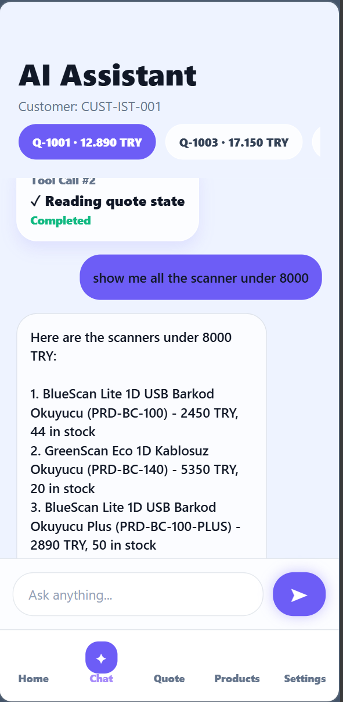


### Quote Management
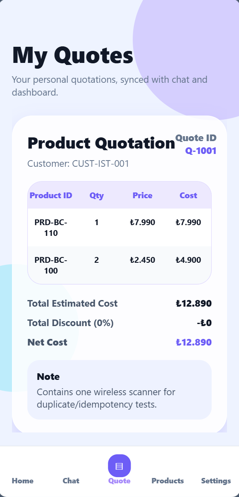 , 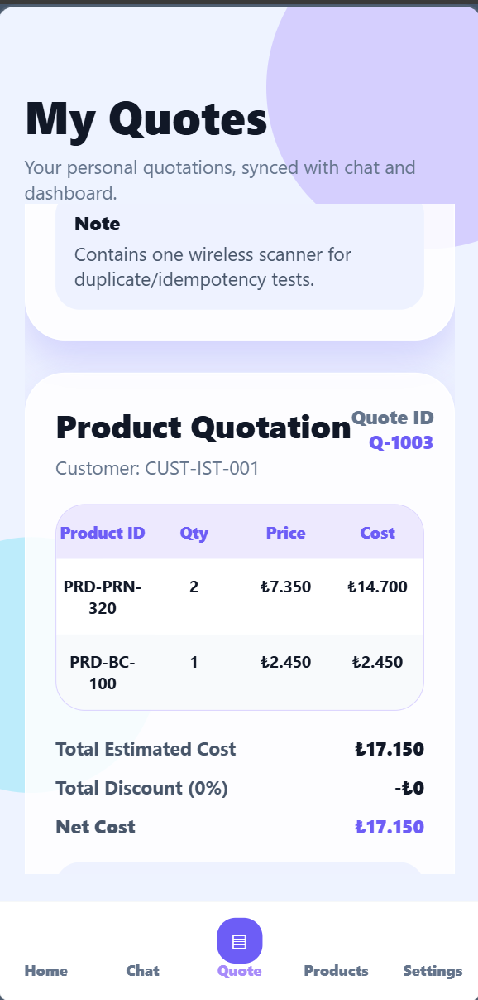


### Product Catalog
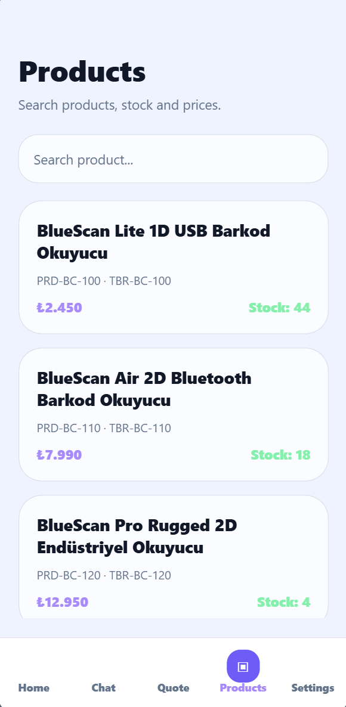


### Settings
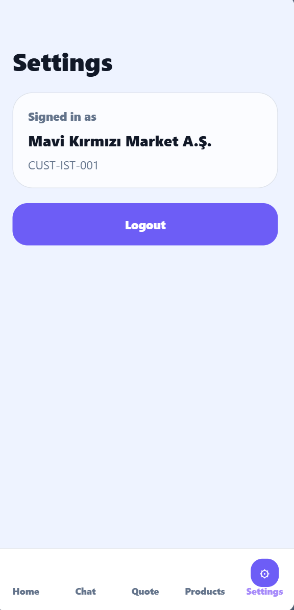


## Web Admin Dashboard
### Dashboard Overview
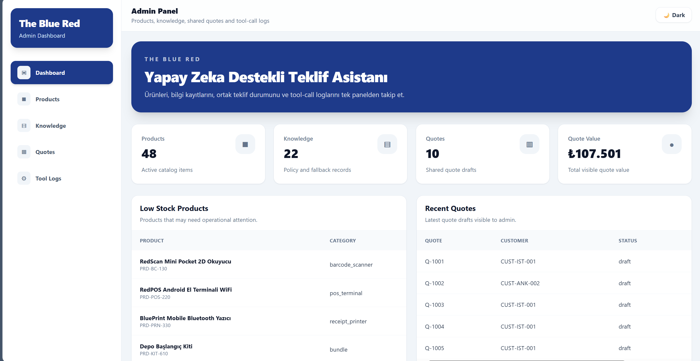


### Product Management

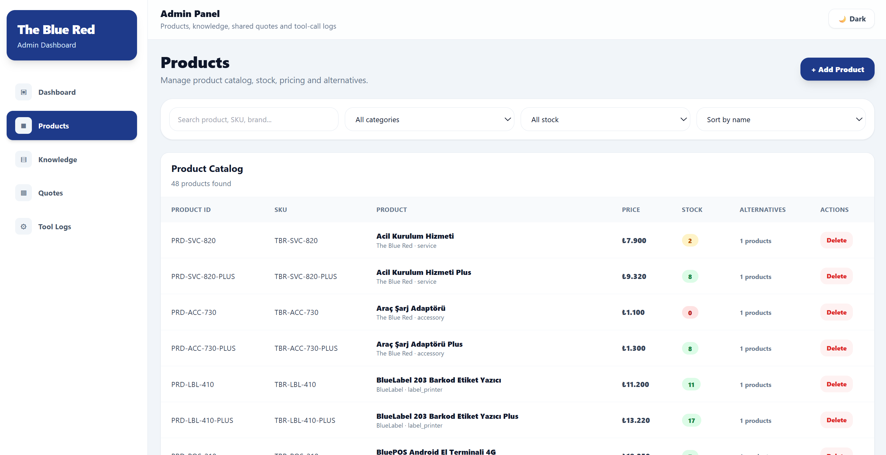 , 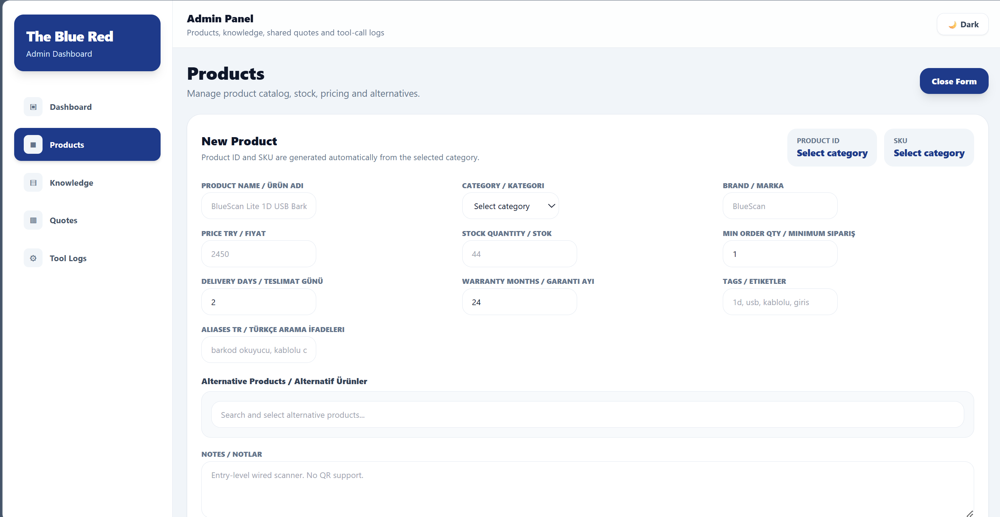


### nowledge Base

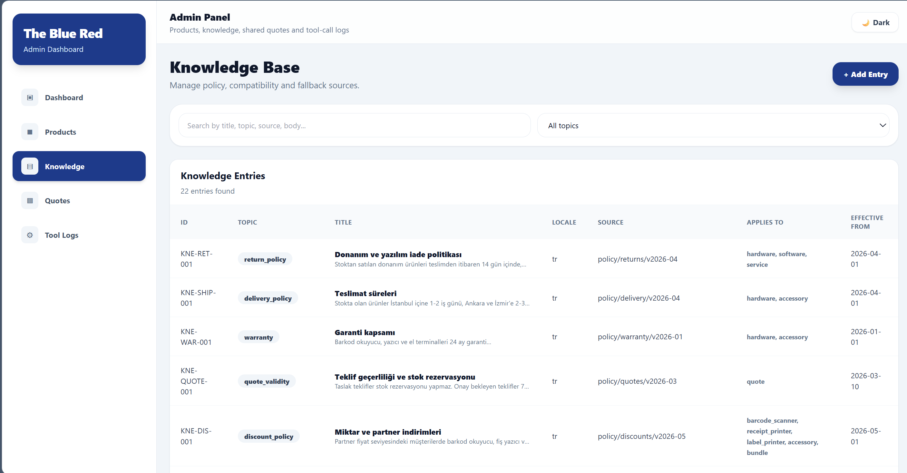 , 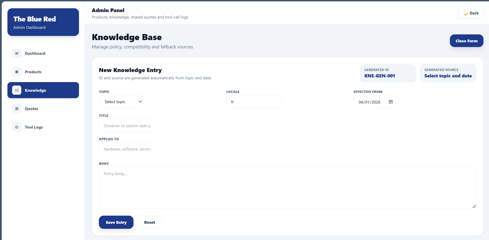


### Quote Management

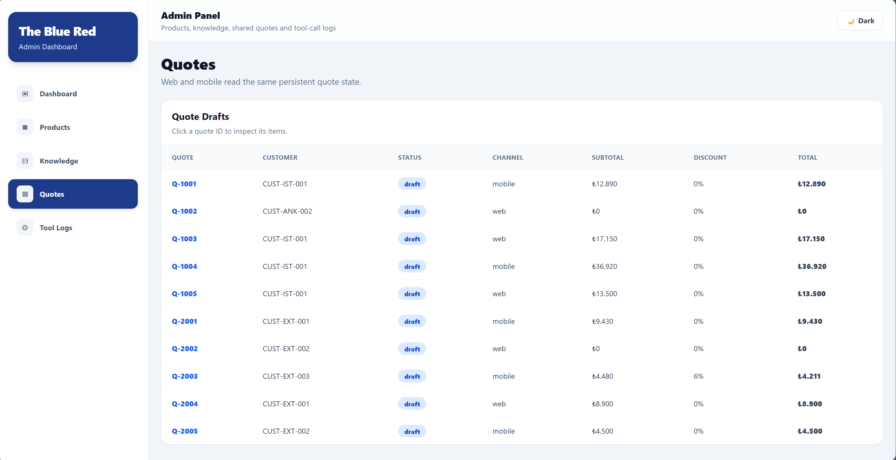

### Tool Call Logs
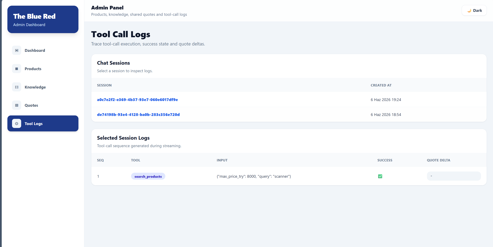 

## Tech Stack

- FastAPI
- PostgreSQL
- SQLAlchemy Async
- React
- React Native / Expo
- Docker Compose
- Groq / OpenAI-compatible LLM API

## Main Features

- Streaming chat with Server-Sent Events
- Product search by text, Turkish aliases, category, price limit, stock, and tags
- Knowledge retrieval for policies, delivery, warranty, stock, pricing, compatibility, and fallback
- Shared quote state between mobile and web
- Quote mutations through tools
- Tool-call logs for debugging and evaluation
- Deterministic fallback mode when LLM is disabled
- Customer authentication for mobile
- Admin dashboard for products, knowledge, quotes, and tool logs

## Required Tool Calls

The backend implements these required tools:

1. `search_products`
2. `get_knowledge_entries`
3. `get_quote`
4. `add_to_quote`
5. `update_quote_item`
6. `replace_with_alternative`

All quote mutations are persisted in PostgreSQL.

## Business Rules

- Price limits are strict. Products above the user's stated maximum price are not recommended or automatically added.
- Products with stock quantity 0 are not recommended by default.
- Backorder is only allowed if the customer is eligible and explicitly accepts waiting.
- Policy answers must include at least one `knowledge_id` source.
- Adding the same product again does not create a second active row; it increases quantity.
- Repeated requests using the same idempotency key do not increase quantity twice.
- Replacing a product marks the previous item as inactive or replaced.

## Streaming Events

The chat stream emits traceable events:

- message start with `session_id`
- tool-call start with tool name, input summary, and sequence number
- tool-call result with success state and quote delta
- source IDs such as `product_id` or `knowledge_id`
- text chunks
- final done or controlled error

## Project Structure

```txt
backend/
  app/
    api/
    core/
    db/
    models/
    schemas/
    services/
    tools/
  data/
  Dockerfile

web/
  src/
    components/
    pages/
    services/
  Dockerfile

mobile/
  src/
    api/
    components/
    context/
    navigation/
    screens/
    services/
    theme/
    utils/
````

## Environment Variables

Create a `.env` file in the project root:

```env
POSTGRES_USER=blured
POSTGRES_PASSWORD=blured123
POSTGRES_DB=blureddb
DATABASE_URL=postgresql+asyncpg://blured:blured123@db:5432/blureddb

OPENAI_API_KEY=your_groq_or_openai_key
OPENAI_MODEL=llama-3.1-8b-instant
OPENAI_BASE_URL=https://api.groq.com/openai/v1

SECRET_KEY=dev-secret-change-in-production
ENVIRONMENT=development

JWT_SECRET_KEY=change-this-secret
JWT_ALGORITHM=HS256
JWT_EXPIRE_MINUTES=1440

VITE_API_URL=http://localhost:8000
```

Do not commit real API keys.

## Run with Docker Compose

From the project root:

```bash
docker compose up --build
```

Backend:

```txt
http://localhost:8000
```

Swagger:

```txt
http://localhost:8000/docs
```

Web admin:

```txt
http://localhost:5173
```

pgAdmin:

```txt
http://localhost:5050
```

## Run Mobile App

From the `mobile` folder:

```bash
npm install
npx expo start
```

For web preview:

```bash
npx expo start --web
```

## Seed Data

Seed data is loaded automatically on backend startup if the database is empty.

The dataset includes:

* products
* knowledge entries
* customers
* quotes
* quote items
* price rules

## Backend Endpoints

Main backend flows:

* `POST /api/v1/chat/stream`
* `GET /api/v1/products`
* `POST /api/v1/products`
* `GET /api/v1/knowledge`
* `POST /api/v1/knowledge`
* `GET /api/v1/quotes`
* `GET /api/v1/quotes/{quote_id}`
* authentication endpoints for mobile customers

## Web Admin

The web panel supports:

* product listing
* product creation
* knowledge listing
* knowledge creation
* quote viewing
* tool-call log viewing

The admin can see quote mutations made from the mobile chat.

## Mobile App

The mobile app supports:

* customer login
* streaming AI chat
* quote selection
* product and policy questions
* source display
* quote update display
* quote screen synced with backend
* product catalog screen

## Fallback Mode

If `OPENAI_API_KEY` is missing, the backend does not call an LLM.

Instead, it uses deterministic orchestration:

* detects user intent
* calls the required tools
* returns grounded product, policy, or quote responses
* avoids unsafe mutations
* still emits streaming events

## AI Usage

The LLM is used for natural language understanding and response generation.

Tool calls are used for all critical operations:

* product retrieval
* policy retrieval
* quote reading
* quote mutation

The LLM is not trusted to invent products, prices, stock, policies, or quote state.

## Testing Checklist

Recommended checks:

* product retrieval returns correct products
* knowledge retrieval returns correct `knowledge_id`
* price limits are respected
* stock 0 products are not added automatically
* add to quote persists changes
* adding the same product increases quantity
* idempotency prevents duplicate quantity increases
* update quote item changes quantity
* replace with alternative updates quote items correctly
* fallback works without API key
* web and mobile show the same quote state

## Known Limitations

* Chat memory may be limited depending on the current implementation.
* Product search uses SQL-based retrieval rather than embeddings.
* Mobile UI is optimized for demo flow.
* Fallback mode is deterministic and less conversational than LLM mode.
* Real production deployment would require stronger secrets, migrations, monitoring, and role-based admin authentication.

## Demo Flow

Suggested demo:

1. Start Docker Compose.
2. Open web admin and show products, knowledge, quotes, and tool logs.
3. Open mobile app and login as a customer.
4. Ask for a product under a price limit.
5. Add the product to the quote from chat.
6. Open the quote screen in mobile.
7. Open the quote in web admin and confirm the same state.
8. Ask a policy question and verify knowledge sources.
9. Disable the API key and show fallback mode.

```
```
